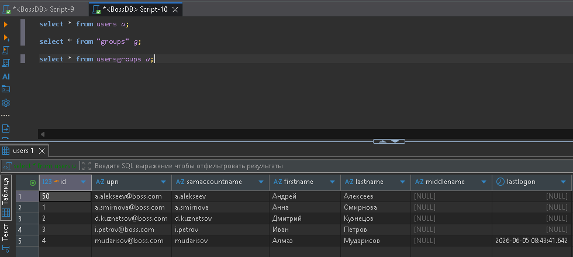
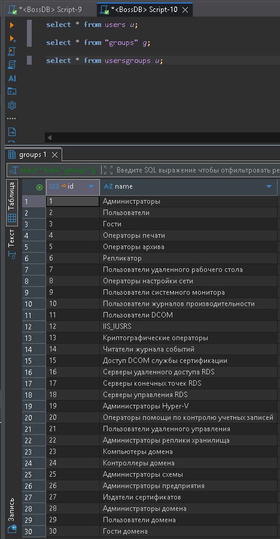
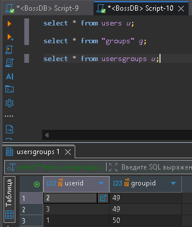
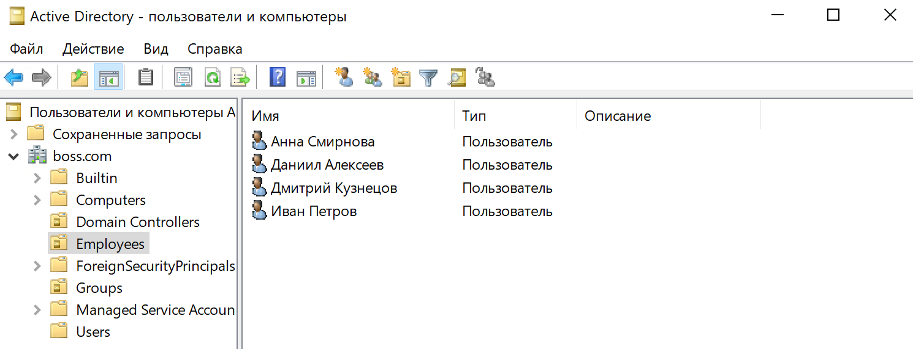
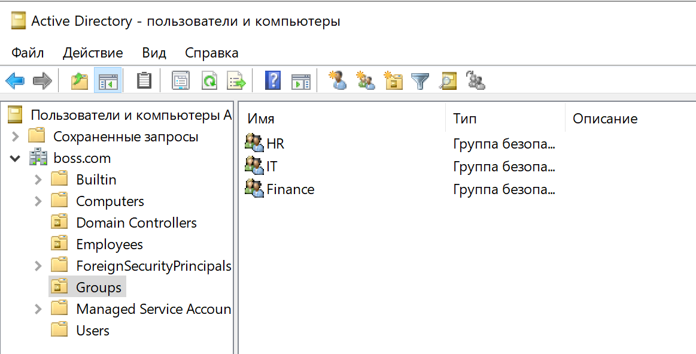
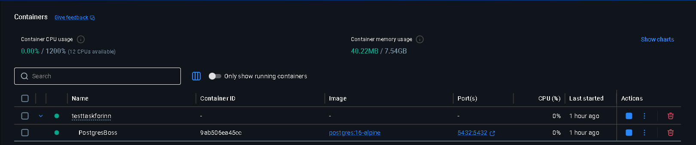

# TestTaskForInn

##  Описание проекта

Данный проект представляет собой систему синхронизации данных из Active Directory в PostgreSQL с использованием Python.

---

##  Инфраструктура

### 1. Виртуализация
Была использована VirtualBox для развертывания виртуальных машин.

### 2. Active Directory
На виртуальной машине установлен **Windows Server 2022**, на котором выполнены следующие настройки:

- Развернут контроллер домена
- Настроен DNS-сервер
- Установлен статический IP-адрес
- Сетевой адаптер настроен в режиме Bridge (сетевой мост)

После настройки сервер стал доменным контроллером домена `boss.com`.

---

### 3. Клиентская машина
Дополнительно установлена Windows-машина, подключенная к домену `boss.com` через локальную сеть.

---

## Настройка Active Directory

В домене были созданы:

- Организационные подразделения (OU)
- Пользователи
- Группы безопасности

Пользователи были добавлены в соответствующие группы для моделирования структуры реальной организации.

---

## База данных PostgreSQL

PostgreSQL был развернут с использованием Docker.

### Подключение:
Использовался инструмент **DBeaver** для управления базой данных.

### Создана база данных:
- `BossDB`

### Созданные таблицы:

- `Users`
- `Groups`
- `UsersGroups`

Данные таблицы используются для хранения информации о пользователях, группах и их связях.

---

##  Разработка Python-скрипта

Среда разработки:
- Python 3.12
- IntelliJ IDEA
- virtualenv

### Используемые библиотеки:

- `ldap3` — подключение к Active Directory через LDAP
- `psycopg2` — работа с PostgreSQL

---

##  Функциональность скрипта

Разработанный скрипт выполняет следующие задачи:

### 1. Подключение к Active Directory
- Авторизация в домене `boss.com`
- Получение списка пользователей и групп

### 2. Извлечение данных
Из Active Directory извлекаются следующие атрибуты пользователей:
- User Principal Name (UPN)
- sAMAccountName
- Имя (First Name)
- Фамилия (Last Name)
- Отчество (при наличии)

Также извлекается информация о группах и их участниках.

---

### 3. Запись в PostgreSQL
- Пользователи сохраняются в таблицу `Users`
- Группы сохраняются в таблицу `Groups`
- Связи пользователей и групп сохраняются в таблице `UsersGroups`

---

### 4. Обновление данных
При повторном запуске скрипта:
- данные обновляются (UPSERT)
- дубликаты не создаются
- информация синхронизируется с Active Directory

---

##  Результат работы

Система обеспечивает:

- автоматическую синхронизацию AD → PostgreSQL
- актуальность данных пользователей и групп
- хранение связей пользователей и групп
- возможность повторного запуска без потери данных

---

## Вывод

В рамках задания была реализована интеграция:

**Active Directory → Python → PostgreSQL**

Система демонстрирует базовые принципы:
- работы с LDAP
- ETL-процесса
- нормализованной реляционной модели
- синхронизации данных между системами

---

## Использованные технологии

- Windows Server 2022
- Active Directory Domain Services
- RDP
- Docker
- PostgreSQL 16:alpine
- DBeaver
- Python 3.12
- ldap3
- psycopg2
- VirtualBox

## Инструкция по запуску (QUICK START)

### Поднимаем БД в Docker 

Запускаем команду в терминале находясь в корне проекта
```commandline
docker compose up -d
```

### Установка библиотек для скрипта

Cоздайте `env` окружение
```commandline
python -m venv .venv
```
Запустите это окружение
```commandline
\.venv\Scripts\activate.bat
```
Запускаем установку библиотек
```commandline
pip install -r requirements.txt
```

### Заполните env 
Создайте файл `.env` и заполните необходимые данные 

## Демонстрация работы

В корне проекта есть логи sync.log

Скриншот из DBeaver






Скриншот из AD





Скриншот из Docker

